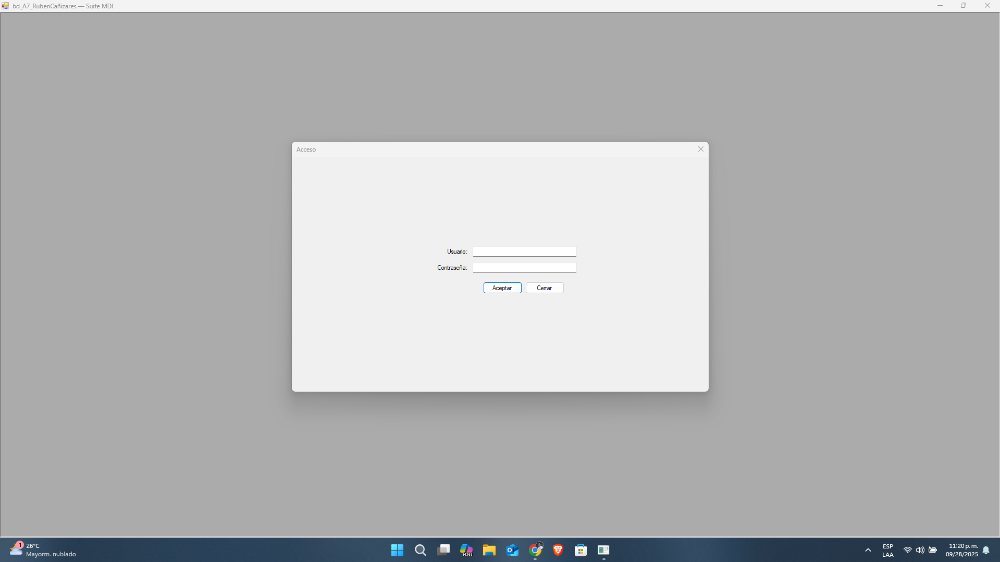
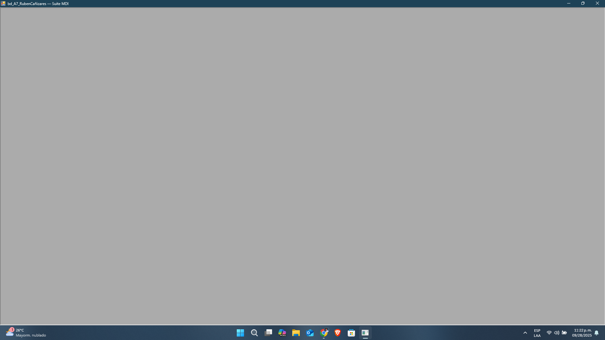
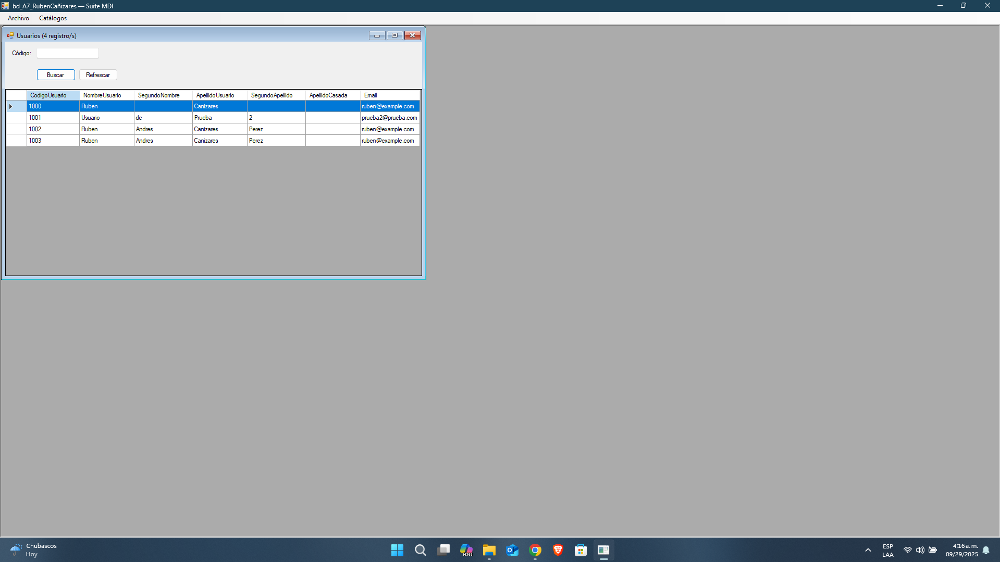
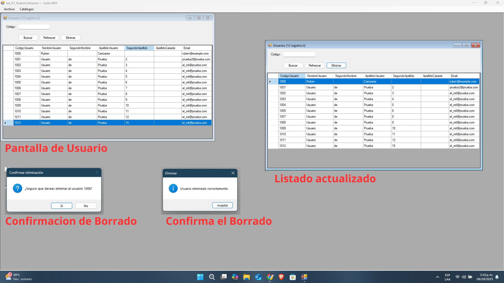

# SuiteMDI-Educativa-SQLServer ✨
[](https://github.com/recm0708/SuiteMDI-Educativa-SQLServer/actions/workflows/build.yml)
[](./LICENSE)

## Descripción 
Aplicación educativa en **C# WinForms (.NET Framework 4.8)** con interfaz **MDI**, **inicio de sesión** validado por SP y **CRUD de usuarios** sobre **SQL Server** (prioridad **Docker**, opción **Local**). Se basa en guías PDF (Partes A/B/C) y se personaliza con estilos, organización por capas y buenas prácticas (scripts SQL idempotentes, control de configuración, repo profesional).

---

## 📚 Contenidos
- [Estructura del repositorio](#estructura-del-repositorio)
- [Requisitos](#requisitos)
- [Configuración inicial](#configuración-inicial)
- [Configuración de Base de Datos (SQL)](#configuracion-de-base-de-datos-sql)
- [Variables/Secretos y seguridad](#variablessecretos-y-seguridad)
- [Ejecución y pruebas](#ejecucion-y-pruebas)
- [Flujo de trabajo con GitHub Desktop](#flujo-de-trabajo-con-github-desktop)
- [Convenciones y calidad](#convenciones-y-calidad)
- [Problemas comunes](#problemas-comunes)
- [Vistas](#vistas)
- [Roadmap y Releases](#roadmap-y-releases)
- [Licencia](#licencia)

---

<a name="estructura-del-repositorio"></a>
## 📁 Estructura del Repositorio
```
SuiteMDI-Educativa-SQLServer/
│
├── .github/                              # Configuración de GitHub (CI, plantillas, dueños de código)
│   ├── ISSUE_TEMPLATE/                   # Plantillas para crear Issues
│   │   ├── bug_report                    # Reporte de errores (plantilla)
│   │   └── feature_request               # Solicitud de mejoras (plantilla)
│   ├── workflows/
│   │   └── build                         # GitHub Actions: build en Windows
│   ├── CODEOWNERS                        # Responsables por defecto de revisiones (PRs)
│   └── PULL_REQUEST_TEMPLATE             # Plantilla de Pull Requests
│
├── assets/                               # Logos, íconos e imágenes (para UI y README)
│   ├── logo.png
│   └── icons/
│
├── db_scripts/                           # Scripts SQL (01 … 09) con comentarios y pruebas
│   ├── 01_CrearBD_y_Tablas-mejorado.sql
│   ├── 02_CrearProcedimiento_VerificarUsuario_Valido_Sin_Encripcion-mejorado.sql
│   ├── 03_CrearProcedimiento_De_InsertarDatos_Sin_Encripcion-mejorado.sql
│   ├── 04_CrearProcedimiento_de_Consulta_de_Usuario-mejorado.sql
│   ├── 05_CrearProcedimiento_de_Eliminación_de_Usuario-mejorado.sql (pendiente)
│   ├── 06_CrearProcedimiento_de_Modificar_de_Usuario-mejorado.sql (pendiente)
│   ├── 07_CrearProcedimiento_de_Modificar_PassWord_Sin_Encripcion-mejorado.sql (pendiente)
│   ├── 08_TablasDelAplicativo-mejorado.sql (pendiente)
│   └── 09_ProcedimientosAplicativo-mejorado.sql (pendiente)
│
├── docs/                                 # Documentación, capturas y diagramas
│   ├── capturas/
│   │   ├── frmAcceso.png
│   │   └── frmMDI.png
│   └── diagramas/
│
├── src/                                  # Solución y proyecto de Visual Studio (WinForms .NET 4.8)
│   ├── Assets/                           # Recursos internos del proyecto (iconos, imágenes, etc.)
│   ├── Datos/                            # ClsConexion y acceso a datos (SqlClient, SPs)
│   ├── Negocio/                          # Clases de procesos/servicios (CRUD, lógica)
│   ├── Presentacion/                     # Formularios (MDI, Acceso, Usuarios, etc.)
│   ├── Properties/                       # AssemblyInfo y recursos de WinForms
│   ├── Soporte/                          # Globales, ThemeHelper y utilidades
│   ├── App.config.template.config        # Plantilla (NO versionar App.config real)
│   ├── bd_A7_RubenCanizares.csproj       # Proyecto WinForms
│   ├── bd_A7_RubenCanizares.sln          # Solución principal
│   └── Program.cs                        # Punto de entrada de la app
│
├── tools/                                # Utilidades (opcional)
│
├── .gitattributes                        # Normaliza fin de línea y tipos de archivo
├── .gitignore                            # Ignora src/_gsdata_/ y src/**/App.config, entre otros
├── CHANGELOG.md                          # Historial de cambios
├── CONTRIBUTING.md                       # Guía para contribuir (issues, PRs, estilo)
├── LICENSE                               # MIT (bilingüe)
├── README.md                             # Este archivo
└── SECURITY.md                           # Política de seguridad y manejo de secretos
```

> 🔒 **No se versiona** ningún `App.config` real; se usa plantilla `App.config.template.config`.

---

<a name="requisitos"></a>
## ✅ Requisitos

- 🧩 **Visual Studio 2022** (Enterprise) – Español  
- 🧱 **.NET Framework 4.8**  
- 🐳 **SQL Server 2022 en Docker** (puerto `127.0.0.1,2333`)  
- 🗄️ **SSMS** (SQL Server Management Studio)  
- 🔁 **GitHub Desktop** (para sincronizar entre PCs)

---

<a name="configuración-inicial"></a>
## 🛠️ Configuración Inicial

1. **Clonar** el repositorio (o crear la carpeta local con GitHub Desktop):  
   `C:\GitHub Repositories\SuiteMDI-Educativa-SQLServer\`
2. **Abrir en VS** la solución en `/src/`.
3. **Crear** tu `App.config` desde la plantilla:
   - Copia `src/bd_A7_RubenCanizares/App.config.example` → renómbralo a **`App.config`**.
   - Edita la contraseña real de SQL en `SqlDocker` (y `SqlLocal` si lo usas).
4. **Docker/SQL** en marcha:
   - Contenedor SQL Server expuesto en `127.0.0.1,2333`.
   - Usuario: `sa`, Password: la tuya (colócala en `App.config`).
5. **Ejecutar scripts SQL** (ver siguiente sección).

---

<a name="configuracion-de-base-de-datos-sql"></a>
## 🧩 Configuración de Base de Datos (SQL)

Ejecuta los scripts de **/db_scripts** en **este orden** usando **SSMS** conectado a `127.0.0.1,2333` como `sa` (o el usuario que definas).  
> Sugerencia: ejecuta cada script por bloques y revisa las **pruebas comentadas** al final de cada uno.

1. `01_CrearBD_y_Tablas-mejorado.sql`  
   - Crea la BD **Ejemplo_SIN_Encripcion** y la tabla **dbo.Perfiles** (IDENTITY desde 1000).  
   - Crea **LOGIN/USER** `UsrProcesa` (rol `db_owner` para DEV).  
   - Es **idempotente** y trae **SELECT/PRUEBAS** comentadas.
   - **Incluye** bloque **OPCIONAL (DEV)** de **reseed** del IDENTITY de `Perfiles` al `MAX(CodigoUsuario)` (para alinear consecutivos en desarrollo).

2. `02_CrearProcedimiento_VerificarUsuario_Valido_Sin_Encripcion-mejorado.sql`  
   - Crea **dbo.prValidarUsuario** (validación de acceso).  
   - Compara **Pass** como `VARBINARY(128)` vía `CONVERT` (sin encriptar realmente).  
   - Incluye pruebas de ejemplo.

3. `03_CrearProcedimiento_De_InsertarDatos_Sin_Encripcion-mejorado.sql`  
   - Crea **dbo.prInsertarUsuario** con **`@CodigoUsuario OUTPUT`**.  
   - Inserta `Pass` como `VARBINARY(128)` desde `VARCHAR`.  
   - Pruebas: inserción y validación con `prValidarUsuario`.

4. `04_CrearProcedimiento_de_Consulta_de_Usuario-mejorado.sql`  
   - Crea **dbo.prConsultarUsuarios**.  
   - `@CodigoUsuario = 0` → devuelve **todos**; `> 0` → devuelve **uno**.  
   - Nunca devuelve **Pass**; incluye `ORDER BY CodigoUsuario`.  

5. `05_CrearProcedimiento_de_Eliminación_de_Usuario-mejorado.sql`  
   - Crea **dbo.prEliminarUsuario(@CodigoUsuario INT)**.  
   - Elimina por código y **retorna `@@ROWCOUNT`** (1 = eliminado, 0 = no existía).  
   - Pruebas: `SELECT` antes/después + verificación de código de retorno.

6. `06_CrearProcedimiento_de_Modificar_de_Usuario-mejorado.sql`  
   - Crea **dbo.prModificarUsuarios(@CodigoUsuario, …)**.  
   - Actualiza datos (sin cambiar Pass) y **retorna `@@ROWCOUNT`** (1 = actualizado, 0 = no existía).  
   - Pruebas: SELECT antes/después + verificación de código de retorno.

7. `07_CrearProcedimiento_de_Modificar_PassWord_Sin_Encripcion-mejorado.sql` *(pendiente)*  
8. `08_TablasDelAplicativo-mejorado.sql` *(pendiente)*  
9. `09_ProcedimientosAplicativo-mejorado.sql` *(pendiente)*

### 🧰 Mantenimiento DEV (opcional)
- `10_Mantenimiento_Reseed_Perfiles.sql`  
  - Ajusta el contador **IDENTITY** de `dbo.Perfiles` al **MAX(CodigoUsuario)** existente.  
  - Uso recomendado en **desarrollo** para alinear consecutivos después de pruebas/borrados.  
  - No borra datos. Tras ejecutarlo, el **próximo** `CodigoUsuario` será `MAX + 1`.

**Cómo probar rápido (SSMS):**
```sql
USE Ejemplo_SIN_Encripcion;
SELECT DB_NAME() AS DB;
SELECT OBJECT_ID('dbo.Perfiles','U')  AS Perfiles;
SELECT OBJECT_ID('dbo.prValidarUsuario','P') AS prValidarUsuario;
SELECT OBJECT_ID('dbo.prInsertarUsuario','P') AS prInsertarUsuario;
SELECT OBJECT_ID('dbo.prConsultarUsuarios','P') AS prConsultarUsuarios;
SELECT OBJECT_ID('dbo.prEliminarUsuario','P') AS prEliminarUsuario;
```

---

### ✅ Estado de scripts
- [x] 01_CrearBD_y_Tablas-mejorado.sql  
- [x] 02_CrearProcedimiento_VerificarUsuario_Valido_Sin_Encripcion-mejorado.sql  
- [x] 03_CrearProcedimiento_De_InsertarDatos_Sin_Encripcion-mejorado.sql  
- [x] 04_CrearProcedimiento_de_Consulta_de_Usuario-mejorado.sql  
- [x] 05_CrearProcedimiento_de_Eliminación_de_Usuario-mejorado.sql  
- [x] 06_CrearProcedimiento_de_Modificar_de_Usuario-mejorado.sql 
- [ ] 07_CrearProcedimiento_de_Modificar_PassWord_Sin_Encripcion-mejorado.sql  
- [ ] 08_TablasDelAplicativo-mejorado.sql  
- [ ] 09_ProcedimientosAplicativo-mejorado.sql

**Utilitarios (DEV)**
- [x] 10_Mantenimiento_Reseed_Perfiles.sql

---

<a name="variablessecretos-y-seguridad"></a>
## 🔐 Variables/Secretos y Seguridad

- ❌ **No subir `App.config` real** al repositorio (`.gitignore` ya bloquea `src/**/App.config`).  
- ✅ Se versiona **`App.config.template.config`** con placeholders (ej. `TU_PASSWORD_SA`).  
- 🖥️ En cada PC, crea tu `App.config` local desde la plantilla y coloca tu contraseña real.  
- 🏭 Producción: **usuarios no `sa`**, permisos mínimos y **almacén de secretos** (variables de entorno, Key Vault, etc.).

---

<a name="ejecucion-y-pruebas"></a>
## ▶️ Ejecución y Pruebas

1. **Compilar** en VS: `Compilar → Compilar solución`.  
2. **Ejecutar**: `Depurar → Iniciar sin depuración (Ctrl+F5)`.  
3. Al iniciar, **frmAcceso**:  
   - **Parte A (básica)**: botón **Aceptar** prueba conexión (`SELECT 1`).  
   - **Parte B (avanzada)**: validación real con `dbo.prValidarUsuario`.  
4. **MDI** se abre solo si `Globales.gblInicioCorrecto == 1`.  
5. CRUD de usuarios (cuando esté activo): **frmUsuarios** con grilla y acciones (Consultar/Insertar/Modificar/Eliminar/Cambiar Password).
6. Edita directamente en la grilla (excepto **CodigoUsuario**, solo lectura).
7. Presiona **Guardar edición** para aplicar los cambios (usa SP 06).
8. Mensajes:
  - **Actualizado correctamente**: se refresca la lista.
  - **No existe / sin cambios**: 0 filas afectadas.

### 📄 Consulta de usuarios (frmUsuarios)
- Abrir desde **MDI**: **Catálogos → Usuarios**.
- Búsqueda:
  - Dejar **Código** vacío → muestra **todos**.
  - Escribir **CódigoUsuario** (numérico) → filtra a un registro.
- Si no ves filas, inserta un usuario con el **Script 03** y refresca.

---

<a name="flujo-de-trabajo-con-github-desktop"></a>
## 🔄 Flujo de trabajo con GitHub Desktop

- **Commits** en español (Summary obligatorio).  
- **Push** para sincronizar con GitHub.  
- **Pull** en la otra PC para traer cambios.  
- Vincula commits con Issues usando `Closes #N` en la descripción.

> 🧹 `.gitignore` evita subir `src/**/App.config` y la carpeta oculta `src/_gsdata_/`.

---

<a name="convenciones-y-calidad"></a>
## 🧭 Convenciones y Calidad

- 🧱 **Capas**: `Presentacion`, `Negocio`, `Datos`, `Soporte`.  
- 📜 **SQL**: idempotentes, cabecera con objetivo y **pruebas comentadas**.  
- 🧯 **Errores**: mensajes claros (código y texto).  
- 🎨 **Estilo visual**: ThemeHelper (colores/botones), assets en `/assets`.  
- ✍️ **C#**: comentarios donde haya reglas de negocio o decisiones no triviales.

---

<a name="problemas-comunes"></a>
## 🧰 Problemas Comunes

- ⏱️ **Timeout / no conecta**: verificar contenedor Docker y puerto `2333` mapeado.  
- 🔑 **Login failed for user 'sa' (18456)**: credenciales/política de contraseñas.  
- ❓ **SP no encontrado**: ejecutar 01–09 en orden; revisar `USE`/`OBJECT_ID`.  
- 🧩 **Diseñador WinForms**: si falla por eventos huérfanos, abrir `*.Designer.cs` y quitar `+= ...Click` inexistentes.

---

<a name="vistas"></a>
## 📸 Vistas

| Pantalla | Imagen |
|---|---|
| Inicio de sesión |  |
| MDI Principal |  |
| Usuarios        |  |
| Usuarios (eliminar) |  |

---

<a name="roadmap-y-releases"></a>
## 🗺️ Roadmap y Releases

- **Roadmap**: ver tablero Kanban en la pestaña **Projects** (Roadmap SuiteMDI).  
- **Releases**:  
  - `v0.1.0` — Parte A (estructura + login + scripts 01–03).  
  - `v0.2.0` — Parte B (CRUD completo).  
  - `v0.3.0` — Parte C (mejoras finales y pulido).

---

<a name="licencia"></a>
## 📄 Licencia

Este proyecto está bajo **MIT** (bilingüe). Ver [`LICENSE`](./LICENSE).  
¡Gracias por usar y contribuir a **SuiteMDI-Educativa-SQLServer**! 🙌